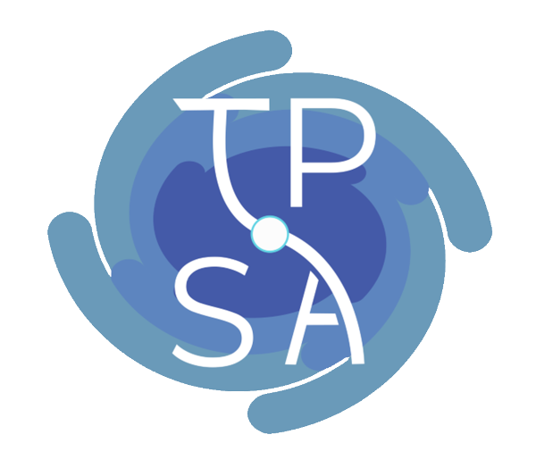

# TPSA Website - Webmaster Guide

The official website for the Theoretical Physics Student Association (TPSA) of Ireland and The Problem Solving Association CLG. 

The site uses a template-based architecture with reusable header and footer components to wrap around page content. This approach generates static HTML pages from modular components - `header.html`, `footer.html`, and `<name>-body.html` to compile the website. There are also a handful of other unique pages such as the `index.html` & `problem-solving.html`. 



# Table of Contents

1. ***Project Structure***
2. ***Quick Start***
3. ***The Build Script***
4. ***Development***
5. ***Deployment***
6. ***Troubleshooting***
7. ***Copyright***

# Project Structure

```
├── site/                   # Generated files + assets (this gets deployed)
│   ├── .htaccess           # URL rerouting and redirects
│   ├── tpsa.css            # Main stylesheet (edit directly)
│   ├── tpsa.js             # JavaScript functions for popups
│   ├── index.html          # Split landing page (edit directly)
│   ├── problem-solving.html# Problem Solving Association page (edit directly)
│   ├── images/             # Image assets directory
│   └── *.html              # Generated pages (DON'T edit these directly)
├── content/                # Page content (edit these)
│   ├── student-body.html   # Becomes student.html (main TPSA page)
│   ├── calendar-body.html  # Becomes calendar.html (events calendar)
│   ├── talks-body.html     # Becomes talks.html (talks cataloge)
│   ├── plancks-body.html   # Becomes plancks.html (competition info)
│   ├── hackathons-body.html# Becomes hackathons.html (workshops & hackathon)
│   ├── lecture-series-body.html # Becomes lecture-series.html (lecture series)
│   ├── internships-body.html # Becomes internships.html (internship opportunities)
│   ├── committee-body.html # Becomes committee.html (committee members)
│   ├── constitution-body.html # Becomes constitution.html (bilingual constitution)
│   ├── history-body.html   # Becomes history.html (TPSA background)
│   └── sign-up-body.html   # Becomes sign-up.html (membership form)
│   └── qiskit-body.html    # Becomes qiskit.html (qiskit ibm )
│   └── torus-body.html     # Becomes torus.html (Tick-Tack-Torus Game)
├── templates/              # Site structure (edit these)
│   ├── header.html         # Navigation, <head>, opening <body>
│   └── footer.html         # Footer, closing </body></html>
├── .github/workflows/      # GitHub Actions for deployment
│   └── build-deploy.yml    # Automated build and deploy workflow
├── .gitignore              # Git ignore patterns
├── tpsa.sh                 # Build script
└── README.md               # This file
```

# Quick Start

1. **Edit content** in `content/` and `templates/` directories
2. **Test locally** by running `./tpsa.sh server` with `venv` (view at localhost:8000)
3. **Commit and push** to a feature branch for review
4. **Merge to main** - GitHub Actions will automatically build and deploy to tpsa.ie

# Build Script

The `tpsa.sh` script is the heart of the build system:

## How it works:
```
header.html + [content]-body.html + footer.html = [content].html
```
- Takes each `*-body.html` file from `content/`
- Wraps it with `templates/header.html` and `templates/footer.html`
- Outputs the complete page to `site/*.html`

## Usage:
```bash
# Build all pages
./tpsa.sh

# Build and start development server at localhost:8000
./tpsa.sh server

# Build specific page only (if you modify the script)
./tpsa.sh <name>    # Only builds <name>.html
```

# Development 

## 1. First Time Setup
```bash
# Clone the repository
git clone https://github.com/ciangregg/tpsa-website.git
cd tpsa-website

# Set up Python virtual environment (if it doesn't exist)
python -m venv venv
source venv/bin/activate  # On Windows: venv\Scripts\activate

# Test the build system
./tpsa.sh server
```

## 2. Editing Content

### Which Files to Edit

#### For Page Content
- `content/student-body.html` → becomes `student.html` (main TPSA homepage with bilingual hero section)
- `content/calendar-body.html` → becomes `calendar.html` (2025 events calendar)
- `content/talks-body.html` → becomes `talks.html` (expert talks with YouTube embeds)
- `content/plancks-body.html` → becomes `plancks.html` (PLANCKS competition info)
- `content/hackathons-body.html` → becomes `hackathons.html` (workshops & hackathon)
- `content/lecture-series-body.html` → becomes `lecture-series.html` (student lecture content)
- `content/internships-body.html` → becomes `internships.html` (internship opportunities)
- `content/committee-body.html` → becomes `committee.html` (committee member profiles)
- `content/constitution-body.html` → becomes `constitution.html` (bilingual constitution with language toggle)
- `content/history-body.html` → becomes `history.html` (TPSA history)
- `content/sign-up-body.html` → becomes `sign-up.html` (Google Form embed)

#### For Site-wide Changes
- `templates/header.html` - Navigation, metadata, opening tags, popup functionality
- `templates/footer.html` - Footer content, closing tags

#### For Unique Pages
- `site/index.html` - Split landing page (TPSA vs Problem Solving Association)
- `site/problem-solving.html` - The Problem Solving Association page with interactive attractor

#### For Styling and Functionality
- `site/tpsa.css` - All website styling, responsive design, animations, language toggle styling
- `site/tpsa.js` - Interactive functions, popup modals, and language switching functionality

## 3. Key Features & Components

### Navigation & Popups
The site uses a sophisticated popup system for "coming soon" features and additional information. Popups are managed through `tpsa.js` and can be triggered with:
```html
<a href="#" onclick="showPopup('Title', 'Message content here')">Link Text</a>
```

### Language Toggle Functionality
The constitution page features a bilingual English/Irish toggle system:
- **Language switching**: Use `switchLanguage('english')` or `switchLanguage('irish')` functions
- **Hero toggle**: The main TPSA page has a clickable logo that toggles between English and Irish
- **Dynamic content**: Content sections are shown/hidden based on language selection
- **Persistent state**: Language selection is maintained during the session

### Responsive Design
The site is fully responsive with breakpoints at 650px and 490px for mobile devices.

### Interactive Elements
- **Problem Solving page**: Features a 3D Halvorsen attractor visualization with React
- **Animations**: Fade-in effects and letter-by-letter animations
- **Hover effects**: Various interactive elements throughout

### URL Management
The `.htaccess` file handles:
- Clean URLs (removes .html extensions)
- Redirects for legacy URLs (`problemsolving` → `problem-solving`, `projects` → `calendar`)

## 4. Testing
Run the build script and test your changes:
```bash
./tpsa.sh server
# Visit http://localhost:8000 to test
```

## 5. Git Workflow
```bash
# Create and switch to a new feature branch
git checkout -b feature-branch-name

# Make your changes...
# Test locally with ./tpsa.sh server

# Stage and commit your changes
git add .
git commit -m "Description of changes"

# Push to remote repository
git push origin feature-branch-name

# Create Pull Request on GitHub for review
# Merge to main once approved
```

# Deployment to **tpsa.ie**

The site uses automated deployment through GitHub Actions. The workflow:

1. **Trigger**: Push to `main` branch or manual workflow dispatch
2. **Build**: GitHub Actions runs `tpsa.sh` to generate all pages
3. **Deploy**: Generated files are pushed to `production` branch
4. **Live**: Plesk automatically pulls changes and updates tpsa.ie

The entire process usually takes 2-3 minutes from push to live site. The deployment configuration is in `.github/workflows/build-deploy.yml`.

### Manual Deployment
If needed, you can trigger deployment manually:
1. Go to the repository's Actions tab on GitHub
2. Select "Build and Deploy TPSA Website"
3. Click "Run workflow"

# Troubleshooting

### Changes not loading?
- Clear browser cache (`Ctrl+Shift+Delete` / `Cmd+Shift+Delete`)
- Hard refresh (`Ctrl+F5` / `Cmd+Shift+R`)
- Check if build completed successfully in GitHub Actions

### Build script issues?
- Ensure `tpsa.sh` has execute permissions: `chmod +x tpsa.sh`
- Verify Python virtual environment is activated
- Check that all required files exist in `content/` and `templates/`

### Styling issues?
- Remember to edit `site/tpsa.css` directly (not generated)
- Use browser developer tools to debug CSS
- Check responsive breakpoints at 650px and 490px widths

### JavaScript errors?
- Check browser console for errors
- Verify `tpsa.js` syntax
- Test popup functionality with `showPopup()` function
- Test language toggle functions `switchLanguage()` and `toggleHeroLanguage()`

### Deployment failures?
- Check GitHub Actions logs for detailed error messages
- Verify all file paths are correct
- Ensure no missing dependencies in build process


# Copyright

© 2025 Theoretical Physics Student Association of Ireland. All rights reserved.